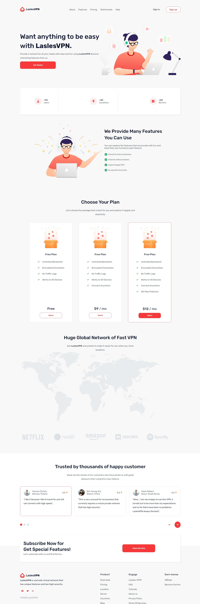

# LaslesVPN Landing Page

## Overview

LaslesVPN is a modern and responsive landing page for a VPN service. Built using **HTML** and **CSS (SCSS)**, it features a clean UI, engaging animations, and a well-structured layout designed for a seamless user experience.

## Features

- Fully responsive design for all devices
- Modern and minimalistic UI
- Subscription plans section
- Customer testimonials slider
- Global VPN network showcase
- SCSS for better styling and maintainability

## Technologies Used

- **HTML5** - For structuring the web page
- **SCSS (Sass)** - For enhanced styling and better maintainability
- **Flexbox & Grid** - For a flexible and structured layout
- **Media Queries** - For responsiveness across devices

## Installation & Usage

1. Clone the repository:
   ```bash
   git clone https://github.com/Yussif20/laseles_vpn_landing_page
   ```
2. Navigate to the project folder:
   ```bash
   cd laslesvpn-landing-page
   ```
3. Open `index.html` in your browser to view the landing page.

## Live Demo & GitHub Repository

- **GitHub Repository:** [LaslesVPN Landing Page](https://github.com/Yussif20/laseles_vpn_landing_page)
- **Live Demo:** [View Live](https://laseles-vpn-landing-page.vercel.app/)

## Screenshot



## Customization

- Modify SCSS variables in `_variables.scss` to change colors, fonts, and styles.
- Add new sections or modify existing ones in `index.html`.
- Optimize images in the `assets/images/` directory for better performance.

---

Developed with ❤️ by **Yusif Ayman**
